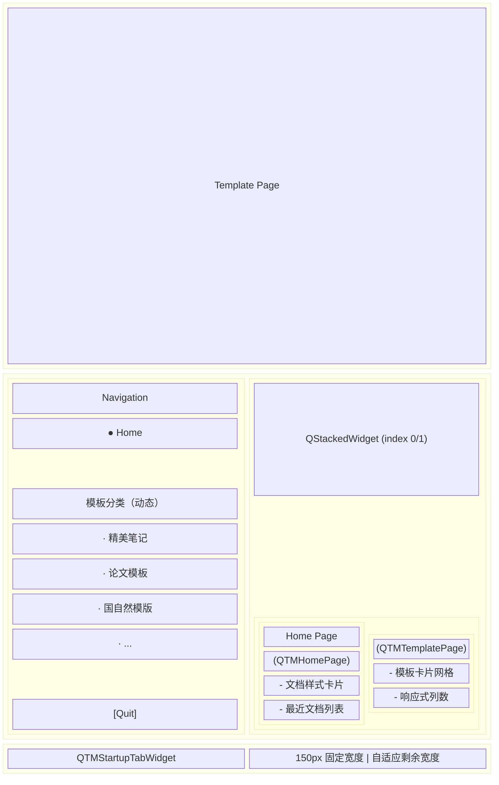
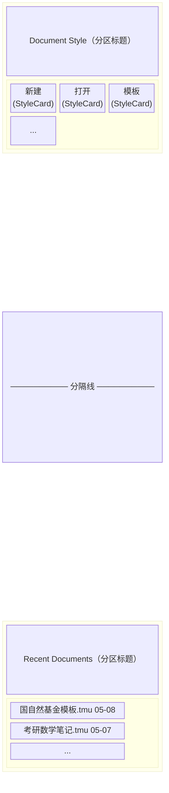
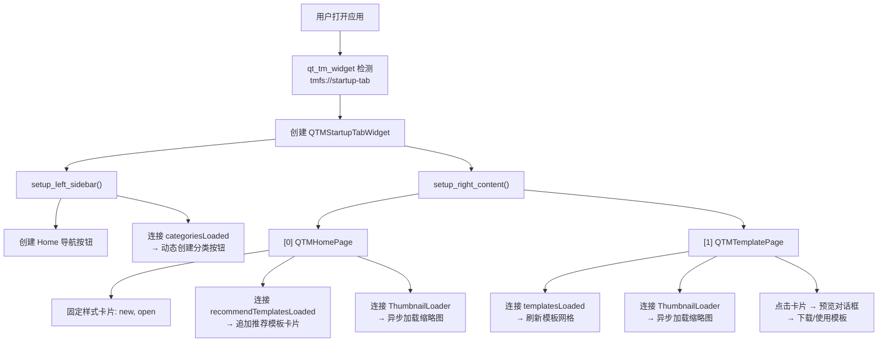

# Mogan Startup 启动页设计文档

## 概述

Mogan 启动页是用户打开应用后的第一个界面，采用**左侧导航栏 + 右侧内容区**的双栏布局，旨在帮助用户快速开始工作——新建/打开文档、浏览模板、查看最近文档。

启动页作为特殊标签页（`tmfs://startup-tab`）固定在标签栏最左侧，不可关闭，始终可见。

---

## 整体架构



---

## 核心组件

### 1. `QTMStartupTabWidget` — 启动页容器

**文件**：`src/Plugins/Qt/QTMStartupTabWidget.hpp/.cpp`

**职责**：
- 管理左右双栏布局
- 维护导航按钮组（`QButtonGroup`，互斥选中）
- 将导航点击映射到右侧 `QStackedWidget` 的页面切换（`Entry::Home` / `Entry::Template`）
- 动态加载模板分类作为导航项（通过 `TemplateManager::categoriesLoaded` 信号）
- 提供 Quit 按钮，调用 `(quit-TeXmacs)`

**入口枚举**：
```cpp
enum class Entry { Home, Template };
```

**关键方法**：
- `set_current_entry(Entry)` — 切换页面入口
- `setup_left_sidebar(QVBoxLayout*)` — 构建导航栏
- `setup_right_content(QStackedWidget*)` — 构建内容区
- `setupCategoryNavButtons()` — 从 `TemplateManager` 动态创建分类导航按钮

**集成点**：在 `qt_tm_widget.cpp` 中被实例化，当检测到 `tmfs://startup-tab` 时显示该 widget。

---

### 2. `QTMHomePage` — 首页

**文件**：`src/Plugins/Qt/QTMHomePage.hpp/.cpp`

**职责**：展示文档样式卡片和最近文档列表。

**布局结构**：



**StyleCard 双重模式**：

| 模式 | 条件 | 外观 | 示例 |
|------|------|------|------|
| **图标模式** | `templateId` 为空 | 大图标 + 名称居中 | 新建文档、打开文档 |
| **缩略图模式** | `templateId` 非空 | 缩略图 + 标题栏 | 远程加载的推荐模板 |

**数据流**：
1. 固定样式卡片（`new`、`open`）在构造函数中硬编码
2. 模板卡片通过 `TemplateManager::recommendTemplatesLoaded` 信号动态追加
3. 缩略图通过 `ThumbnailLoader` 异步加载

**最近文档**：
- 从 Scheme 层 `(startup-tab-get-recent-docs)` 获取路径列表
- 与本地 JSON 文件 `recent-files.json` 合并（补充时间元数据）
- 支持右键菜单：移除单条、清空列表
- 点击打开，文件不存在时自动清理并 toast 提示

---

### 3. `QTMTemplatePage` — 模板分类页

**文件**：`src/Plugins/Qt/QTMTemplatePage.hpp/.cpp`

**职责**：按分类展示模板卡片网格，支持预览、下载和使用。

**功能**：
- 响应式网格布局（`calculateColumnCount()` 根据 viewport 宽度动态计算列数）
- 缩略图异步加载（`ThumbnailLoader`）
- 点击卡片弹出预览对话框（`QDialog`）：显示 PDF 预览、作者、版本、描述 → 可使用模板
- `resizeDebounceTimer_`（200ms）防抖，避免拖拽窗口时频繁重建网格
- 空状态提示：`"Loading templates..."` / `"No templates available."`

---

### 4. `TemplateManager` — 模板数据中心

**文件**：`src/Mogan/TemplateCenter/template_manager.hpp/.cpp`

**职责**：模板元数据管理，协调本地缓存和远程 API。

**数据模型**（`template_types.hpp`）：
```cpp
struct TemplateCategory {
  QString id, name, nameEn, description, icon;
  int order, templateCount;
};

struct TemplateMetadata {
  QString id, name, description, category, author, version, license;
  QString thumbnailUrl, previewUrl, fileUrl;
  qint64 fileSize;
  QString fileMd5;
  QDateTime createdAt, updatedAt;
  QString language;
  QStringList tags;
  QString moganMinVersion;
  int downloadCount;
  double rating;
  QString localPath;
  bool isLocal;
};
```

**关键信号**：
- `categoriesLoaded()` → `QTMStartupTabWidget::setupCategoryNavButtons()`
- `templatesLoaded()` → `QTMTemplatePage::onTemplatesLoaded()`
- `recommendTemplatesLoaded()` → `QTMHomePage::onRecommendTemplatesLoaded()`

**离线模式**：`setOffline(true)` 后所有远程请求在 API 层短路，供测试场景使用。

---

### 5. Scheme 层 — 文件操作绑定

**文件**：`TeXmacs/progs/startup-tab/startup-tab-file.scm`

**导出的函数**：
| 函数 | 用途 |
|------|------|
| `(new-document-with-style style-id)` | 创建指定样式的新文档 |
| `(startup-tab-get-recent-docs)` | 获取最近文档路径列表 |
| `(startup-tab-add-recent-doc path)` | 添加/刷新最近文档 |
| `(startup-tab-clear-recent-doc path)` | 移除指定最近文档 |
| `(startup-tab-clear-all-recent)` | 清空所有最近文档 |

---

## 主题样式

启动页的视觉样式定义在主题 CSS 中：
- **liii.css**（亮色主题）：`TeXmacs/misc/themes/liii.css`
- **liii-night.css**（暗色主题）：`TeXmacs/misc/themes/liii-night.css`

关键样式对象：
| ObjectName | 用途 |
|------------|------|
| `#startup-tab-sidebar` | 左侧导航栏背景 (#215a6a) |
| `#startup-tab-nav-btn` | 导航按钮（普通/悬停/选中） |
| `#startup-tab-quit-btn` | 退出按钮 |
| `#startup-tab-content` | 右侧内容区背景 (#f3f3f3) |
| `#startup-tab-section-title` | 分区标题 |
| `#startup-tab-separator` | 分隔线 |
| `#startup-tab-template-card` | 模板卡片（普通/悬停） |
| `#startup-tab-template-name` | 模板名称 |
| `#startup-tab-template-info` | 模板作者/版本信息 |

---

## 数据流总结



---

## HTML 原型

`ai-docs/startup/startup.html` 是该设计的 HTML 原型，用于快速预览和迭代 UI 设计。

原型与生产代码的对应关系：

| HTML 原型 | C++ 实现 |
|-----------|----------|
| `.sidebar` + `.nav-item` | `QTMStartupTabWidget` 左侧导航栏 |
| `#page-home` → 快速开始卡片 | `QTMHomePage` + `StyleCard`（图标模式） |
| `#page-home` → 模板推荐卡片 | `QTMHomePage` + `StyleCard`（缩略图模式） |
| `#page-home` → 最近文档列表 | `QTMHomePage` + `QListWidget` |
| `#page-thesis` 卡片网格 | `QTMTemplatePage` 响应式网格 |
| `.nav-label` 分组标题 | `#startup-tab-nav-title` QLabel |
| `.exit-btn` | `#startup-tab-quit-btn` |

原型中当前未在生产代码中对应的设计元素：
- **键盘快捷键提示**（`Ctrl+N` / `Ctrl+O` 徽章）— 原型中添加了，但 C++ 代码中未显示
- **模板卡片的差异化配色**（笔记=暖色、国自然=蓝色、论文=紫色、考研=红色）— C++ 代码统一使用白色卡片+缩略图
- **最近文档的文件类型图标**（.tmu / .pdf / 笔记）— C++ 代码仅显示文件名+时间
- **"浏览全部模板 →" 链接** — C++ 代码通过侧边栏分类导航实现

---

## 文件清单

| 文件路径 | 说明 |
|----------|------|
| `src/Plugins/Qt/QTMStartupTabWidget.hpp` | 启动页容器声明 |
| `src/Plugins/Qt/QTMStartupTabWidget.cpp` | 启动页容器实现 |
| `src/Plugins/Qt/QTMHomePage.hpp` | 首页声明 |
| `src/Plugins/Qt/QTMHomePage.cpp` | 首页实现 |
| `src/Plugins/Qt/QTMTemplatePage.hpp` | 模板分类页声明 |
| `src/Plugins/Qt/QTMTemplatePage.cpp` | 模板分类页实现 |
| `src/Plugins/Qt/QTMTemplateOpener.hpp/.cpp` | 模板打开器 |
| `src/Mogan/TemplateCenter/template_manager.hpp` | 模板管理器声明 |
| `src/Mogan/TemplateCenter/template_manager.cpp` | 模板管理器实现 |
| `src/Mogan/TemplateCenter/template_types.hpp` | 模板数据类型 |
| `src/Mogan/TemplateCenter/thumbnail_loader.hpp/.cpp` | 缩略图异步加载器 |
| `TeXmacs/progs/startup-tab/startup-tab.scm` | Scheme 模块入口 |
| `TeXmacs/progs/startup-tab/startup-tab-file.scm` | 文件操作 Scheme 绑定 |
| `TeXmacs/misc/themes/liii.css` | 亮色主题样式 |
| `TeXmacs/misc/themes/liii-night.css` | 暗色主题样式 |
| `ai-docs/startup/startup.html` | HTML UI 原型 |
| `ai-docs/startup/README.md` | 本文档 |
